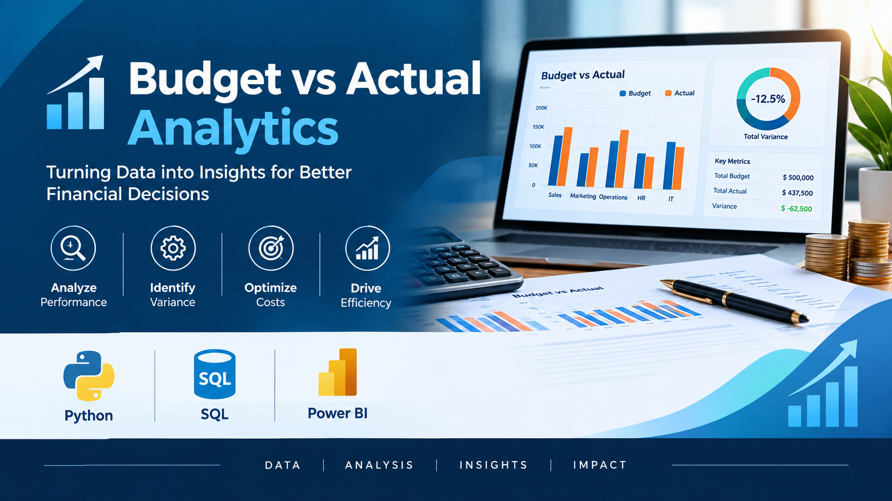

# 📊 Budget vs Actual Performance & Cost Optimization

<p align="center">
  
</p>

## 📌 Project Overview

This project analyzes budgeted versus actual spending to identify financial performance gaps, recurring budget overruns, major cost drivers, and areas requiring stronger cost control.

The project follows an end-to-end data analytics workflow:

**Python → SQL → Power BI → Business Insights**

The analysis combines data cleaning, exploratory analysis, SQL-based business analysis, financial variance analysis, and interactive dashboard reporting.

---

## 🎯 Business Problem

Organizations need to monitor whether actual spending remains within allocated budgets.

Simply comparing total budget and actual spending is not enough. Management also needs to understand:

- Which departments are exceeding their budgets?
- Which expense categories contribute most to overspending?
- Which regions have higher financial variance?
- Which department-category combinations are driving costs?
- Are budget overruns isolated or recurring over time?
- Which specific areas should receive cost-control attention?

This project addresses these questions using Python, SQL, and Power BI.

---

## 🎯 Project Objectives

The main objectives were to:

- Clean and validate financial transaction data
- Identify missing and duplicate records
- Compare budgeted and actual spending
- Calculate financial variance and variance percentage
- Analyze departmental and category-level performance
- Identify department-category cost drivers
- Analyze monthly and annual spending trends
- Compare regional financial performance
- Examine payment-method spending patterns
- Identify high-priority cost-control areas
- Build an interactive Power BI dashboard
- Translate analytical findings into business recommendations

---

## 📂 Dataset

**Dataset:** Budget vs Actual Financial Dataset

**Source:** Kaggle

The dataset contains synthetic financial transaction data covering the period from **2021 to 2023**.

### Dataset Columns

| Column | Description |
|---|---|
| Date | Transaction date |
| Department | Department responsible for the expense |
| Category | Expense category |
| Region | Geographic region |
| Budget Amount | Allocated budget |
| Actual Amount | Actual spending |
| Payment Method | Payment channel |
| Transaction ID | Unique transaction identifier |

### Dataset Quality

The original dataset contained:

- **10,010 records**
- **10 duplicate transactions**
- **8 missing values**

After cleaning:

- **10,000 records**
- **0 duplicate records**
- **0 missing values**

---

# 🛠️ Tools & Technologies

### Python
- Python
- Pandas
- NumPy
- Jupyter Notebook

### SQL
- MySQL
- MySQL Workbench

### Visualization & BI
- Microsoft Power BI
- DAX

### Documentation
- Microsoft Excel
- GitHub

---

# 🔄 Project Workflow

```text
Raw Dataset
     ↓
Data Quality Assessment
     ↓
Data Cleaning with Python
     ↓
Exploratory & Financial Analysis
     ↓
SQL Business Analysis
     ↓
Power BI Data Modeling
     ↓
DAX Measures
     ↓
Interactive Dashboard
     ↓
Business Insights & Recommendations
